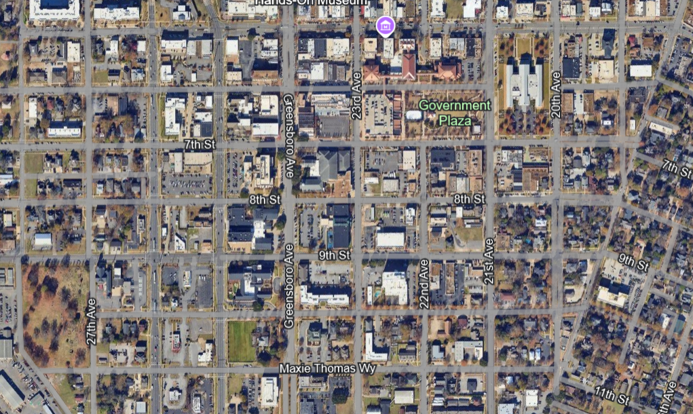

# Google Earth Parser




## 1. Marking Objects in Google Earth

Go to [Google Earth](https://earth.google.com/) to mark objects. Use either the measurement tool to draw a polygon or add a placemarker for each proto. Name objects based on their type:
   
   - **Using the measurement tool:**
     - **"Building"** - Buildings with randomly generated heights
     - **"Base"** - (Optional) Marks the entire simulated area
     - **"Curb"** - Non-drivable areas
     - **"Sidewalk"** - Walkable areas
     - **"End"** - Simulation boundaries
   
   - **Using the placemarker tool:**
     - **"tree"** - Places a tree proto with randomly generated height and width
     - **"sl_#"** - Street light proto (replace `#` with `n`, `e`, `s`, or `w` to indicate direction)
     - **"Stop_sign_#"** - Places a stop sign proto (replace `#` with `n`, `e`, `s`, or `w` to indicate direction)

## 2. Export as KML

Once your objects are marked, select `File > Export as KML file`.

## 3. Place KML in Input Folder

Place the `.kml` file in the [kml_input folder](google_earth_parser/kml_input). Update the `"INPUT_FILE_NAME"` constant in [kml_scrape.py](google_earth_parser/kml_scrape.py) to match your file name.

## 4. Run kml_scrape.py

Navigate to the `google_earth_parser` directory in your terminal and run `kml_scrape.py`. This will store relevant information in a `.json` file in [kml_output](google_earth_parser/kml_output):

   ```bash
   cd google_earth_parser
   python3 kml_scrape.py
   ```

## 5. Generate .wbt File with object_generator.py
Inside of object_generator.py, change the constant "INPUT_FILE" to match your .json file. Then, in the same terminal from step 4, run object_generator.py. This will generate a .wbt file inside of [wbt_output](google_earth_parser/wbt_output).

<pre>
python3 kml_scrape.py
</pre>

Extra: To tweak colors and heights of polygons change the paramters inside of object_generator.py. The directions may  need to be set for the street light and stop sign protos to match the orientation of your simulated environment.

# Launching the simulated environment 

## 1. Set up environment variables for ROS
Make sure to replace '/home/rpi/shared' with your own shared folder location
<pre>
source /opt/ros/humble/setup.bash
</pre>
Also do any Windows or Mac specific setup

For example in Mac...
<pre>
export WEBOTS_HOME=/Applications/Webots.app
python3 local_simulation_server.py
</pre>

For example in windows...
<pre>
export WEBOTS_HOME=/mnt/c/Program\ Files/Webots
</pre>

## 2. Fork your own repository of this project 
(using web interface)

## 3. Clone your fork
<pre>
git clone <your github url for this repository>
</pre>

## 4. Make the package 
(for python, it really just installs the files)
<pre>
cd p1_outdoor
colcon build
</pre>

## 5. Set up variables
<pre>
source install/setup.bash
</pre>

## 6. Start webots simulation
<pre>
ros2 launch outdoor_simulation outdoor_simulation_launch.py
</pre>

## Nightime Simulation
If you would like to run the simulation at night time, comment out the "# Day" set up and un-comment the "# Night" set up at the beginning of [the .wbt file located at](src/outdoor_simulation/worlds/outdoor.wbt)
<pre>
# Day
WorldInfo {
}
TexturedBackground {
}
TexturedBackgroundLight {
}
</pre>
<pre>
# Night
WorldInfo {
}
Background {
  skyColor [0.05 0.05 0.1]  
  luminosity 0.1             
}
DirectionalLight {
  color 0.2 0.2 0.4        
  intensity 0.1             
  direction -1 -1 -1
  castShadows TRUE
}
</pre>

## Recomendations
Due to the complexity of the simulation, I recommend openning Webots prior to trying to run the simulation and changing the following settings

1. Start up project in a paused state
<pre>
Tools > Preferences > General > Startup Mode: Pause, Rendering: Off
</pre>

2. Start up project in a paused state
<pre>
Tools > Preferences > OpenGL > Texture Quality: Low
</pre>

3. Sets the basicTimeStep to 32. Increasing this value will reduce the strain but update the simmulation at a slower rate. It may be preferable to decrease this value for a worse performance but a more accurate result.
<pre>
WorldInfo {
  basicTimeStep 32
}
</pre>